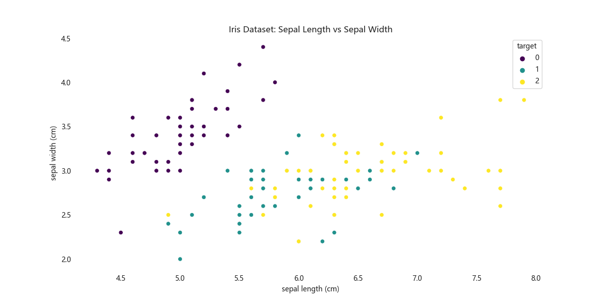
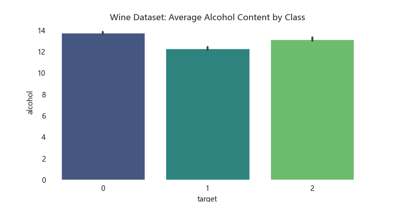

# Project: excel supporting functions

<font size=5><b>Main Functions</b></font><br>
<div>
1. add_df_to_excel: output or append dataframes to excel file<br>
2. add_image_to_excel: insert plots to sheets<br>
3. save_locked_excel: add password, lock columns, fill background color in columns, style with hyperlink, 
pass validations to excel users input.<br>
</div>

[<span style="font-size: 20px;">**usage jupyter notebook here**</span>](excel_functions_showcase.ipynb)

<font size=5><b>Usages</b></font><br>
## 1. packages and global variables
```python
import sys
import pandas as pd
from pathlib import Path
import seaborn as sns
import matplotlib.pyplot as plt
from sklearn.datasets import load_iris, load_wine

# append src path to sys.path
sys.path.append(str(Path.cwd()/'src'))
from add_df_to_excel import add_df_to_excel
from add_image_to_excel import add_image_to_excel
from save_locked_excel import save_locked_excel
```

```python
# GLOBALS
OUTPUT_DATA_PATH = Path.cwd()/'data'
OUTPUT_FIG_PATH = Path.cwd()/'plot'
OUTPUT_DATA_NAME = 'module_test.xlsx'
```

## 2. Load Iris and Boston datasets from sklearn as examples


```python
def load_skl_data(dataset: str): # iris or wine
    if dataset == 'iris':
        data = load_iris()
    elif dataset == 'wine':
        data = load_wine()
    else:
        raise ValueError(f"Invalid dataset: {dataset}")

    df = pd.DataFrame(data['data'], columns=data['feature_names'])
    df['target'] = data['target']
    return df
```

```python
iris = load_skl_data('iris')
iris.head()
```

<div>
<style scoped>
    .dataframe tbody tr th:only-of-type {
        vertical-align: middle;
    }

    .dataframe tbody tr th {
        vertical-align: top;
    }

    .dataframe thead th {
        text-align: right;
    }
</style>
<table border="1" class="dataframe">
  <thead>
    <tr style="text-align: right;">
      <th></th>
      <th>sepal length (cm)</th>
      <th>sepal width (cm)</th>
      <th>petal length (cm)</th>
      <th>petal width (cm)</th>
      <th>target</th>
    </tr>
  </thead>
  <tbody>
    <tr>
      <th>0</th>
      <td>5.1</td>
      <td>3.5</td>
      <td>1.4</td>
      <td>0.2</td>
      <td>0</td>
    </tr>
    <tr>
      <th>1</th>
      <td>4.9</td>
      <td>3.0</td>
      <td>1.4</td>
      <td>0.2</td>
      <td>0</td>
    </tr>
    <tr>
      <th>2</th>
      <td>4.7</td>
      <td>3.2</td>
      <td>1.3</td>
      <td>0.2</td>
      <td>0</td>
    </tr>
    <tr>
      <th>3</th>
      <td>4.6</td>
      <td>3.1</td>
      <td>1.5</td>
      <td>0.2</td>
      <td>0</td>
    </tr>
    <tr>
      <th>4</th>
      <td>5.0</td>
      <td>3.6</td>
      <td>1.4</td>
      <td>0.2</td>
      <td>0</td>
    </tr>
  </tbody>
</table>
</div>


```python
wine = load_skl_data('wine')
wine.head()
```


<div>
<style scoped>
    .dataframe tbody tr th:only-of-type {
        vertical-align: middle;
    }

    .dataframe tbody tr th {
        vertical-align: top;
    }

    .dataframe thead th {
        text-align: right;
    }
</style>
<table border="1" class="dataframe">
  <thead>
    <tr style="text-align: right;">
      <th></th>
      <th>alcohol</th>
      <th>malic_acid</th>
      <th>ash</th>
      <th>alcalinity_of_ash</th>
      <th>magnesium</th>
      <th>total_phenols</th>
      <th>flavanoids</th>
      <th>nonflavanoid_phenols</th>
      <th>proanthocyanins</th>
      <th>color_intensity</th>
      <th>hue</th>
      <th>od280/od315_of_diluted_wines</th>
      <th>proline</th>
      <th>target</th>
    </tr>
  </thead>
  <tbody>
    <tr>
      <th>0</th>
      <td>14.23</td>
      <td>1.71</td>
      <td>2.43</td>
      <td>15.6</td>
      <td>127.0</td>
      <td>2.80</td>
      <td>3.06</td>
      <td>0.28</td>
      <td>2.29</td>
      <td>5.64</td>
      <td>1.04</td>
      <td>3.92</td>
      <td>1065.0</td>
      <td>0</td>
    </tr>
    <tr>
      <th>1</th>
      <td>13.20</td>
      <td>1.78</td>
      <td>2.14</td>
      <td>11.2</td>
      <td>100.0</td>
      <td>2.65</td>
      <td>2.76</td>
      <td>0.26</td>
      <td>1.28</td>
      <td>4.38</td>
      <td>1.05</td>
      <td>3.40</td>
      <td>1050.0</td>
      <td>0</td>
    </tr>
    <tr>
      <th>2</th>
      <td>13.16</td>
      <td>2.36</td>
      <td>2.67</td>
      <td>18.6</td>
      <td>101.0</td>
      <td>2.80</td>
      <td>3.24</td>
      <td>0.30</td>
      <td>2.81</td>
      <td>5.68</td>
      <td>1.03</td>
      <td>3.17</td>
      <td>1185.0</td>
      <td>0</td>
    </tr>
    <tr>
      <th>3</th>
      <td>14.37</td>
      <td>1.95</td>
      <td>2.50</td>
      <td>16.8</td>
      <td>113.0</td>
      <td>3.85</td>
      <td>3.49</td>
      <td>0.24</td>
      <td>2.18</td>
      <td>7.80</td>
      <td>0.86</td>
      <td>3.45</td>
      <td>1480.0</td>
      <td>0</td>
    </tr>
    <tr>
      <th>4</th>
      <td>13.24</td>
      <td>2.59</td>
      <td>2.87</td>
      <td>21.0</td>
      <td>118.0</td>
      <td>2.80</td>
      <td>2.69</td>
      <td>0.39</td>
      <td>1.82</td>
      <td>4.32</td>
      <td>1.04</td>
      <td>2.93</td>
      <td>735.0</td>
      <td>0</td>
    </tr>
  </tbody>
</table>
</div>


## 3. Save dataframes (add_df_to_excel)

### 3.1: create empty and save Iris dataset to excel

```python
add_df_to_excel(
    df=iris,
    file_path=OUTPUT_DATA_PATH,
    file_name=OUTPUT_DATA_NAME,
    new_sheet_name='iris',
    if_sheet_exists='replace',  # {‘error’, ‘new’, ‘replace’, ‘overlay’}
    create_if_not_exist=True,
    keep_index=False
)
```

    Created C:\Users\Qilun\Desktop\Lvzhi\projects\excel_functions\data\module_test.xlsx
    Created iris in C:\Users\Qilun\Desktop\Lvzhi\projects\excel_functions\data\module_test.xlsx
    iris has been saved to module_test.xlsx at C:\Users\Qilun\Desktop\Lvzhi\projects\excel_functions\data

### 3.2: append Wine dataset to the same excel


```python
add_df_to_excel(
    df=wine,
    file_path=OUTPUT_DATA_PATH,
    file_name=OUTPUT_DATA_NAME,
    new_sheet_name='wine',
    if_sheet_exists='replace',
    create_if_not_exist=False,
    keep_index=False
)
```

    wine does not exist in C:\Users\Qilun\Desktop\Lvzhi\projects\excel_functions\data\module_test.xlsx
    wine has been saved to module_test.xlsx at C:\Users\Qilun\Desktop\Lvzhi\projects\excel_functions\data

## 4. Save Plots (add_image_to_excel)

### 4.1: save Iris plot to excel

```python
plt.rcParams['font.sans-serif'] = ['Microsoft YaHei']
plt.rcParams['axes.unicode_minus'] = False
plt.rcParams['figure.dpi'] = 100
plt.rcParams['axes.facecolor']='white'
plt.rcParams['savefig.facecolor']='white'
```


```python
def plot_iris(df: pd.DataFrame, save_path: Path = OUTPUT_FIG_PATH):
    plt.figure(figsize=(12, 6))
    sns.scatterplot(data=df, x='sepal length (cm)', y='sepal width (cm)', hue='target', palette='viridis')
    plt.title('Iris Dataset: Sepal Length vs Sepal Width')
    plt.savefig(save_path/'iris_plot.png')
```

```python
plot_iris(iris)
```



```python
add_image_to_excel(
    position='right',
    gap=2,
    figsize=(8,4),
    dpi=100,
    image_path=OUTPUT_FIG_PATH,
    image_name='iris_plot.png',
    excel_path=OUTPUT_DATA_PATH,
    excel_name=OUTPUT_DATA_NAME,
    sheet_name='iris',
)
```
    iris_plot.png added to excel module_test.xlsx, sheet iris

### 4.2: save Wine plot to excel
```python
def plot_wine(df: pd.DataFrame,  save_path: Path = OUTPUT_FIG_PATH):
    plt.figure(figsize=(8,4))
    sns.barplot(x='target', y='alcohol', data=df, palette='viridis')
    plt.title('Wine Dataset: Average Alcohol Content by Class')
    plt.savefig(save_path/'wine_plot.png')
```

```python
plot_wine(wine)
```



```python
add_image_to_excel(
    position='bottom',
    gap=2,
    figsize=(8,4),
    dpi=100,
    image_path=OUTPUT_FIG_PATH,
    image_name='wine_plot.png',
    excel_path=OUTPUT_DATA_PATH,
    excel_name=OUTPUT_DATA_NAME,
    sheet_name='wine',
)
```


    wine_plot.png added to excel module_test.xlsx, sheet wine

## 4. Save locked excel (save_locked_excel)


```python
def create_output_df():
    df = pd.DataFrame({
        'col1': ['a', 'b', 'c'],
        'col2': ['d', 'e', 'f'],
        'col3': [0.001, 0.285, pd.NA],
        'link':['https://www.google.com', 'https://www.baidu.com', 'https://www.bing.com']})
    return df
```


```python
output_df = create_output_df()
output_df
```


<div>
<style scoped>
    .dataframe tbody tr th:only-of-type {
        vertical-align: middle;
    }

    .dataframe tbody tr th {
        vertical-align: top;
    }

    .dataframe thead th {
        text-align: right;
    }
</style>
<table border="1" class="dataframe">
  <thead>
    <tr style="text-align: right;">
      <th></th>
      <th>col1</th>
      <th>col2</th>
      <th>col3</th>
      <th>link</th>
    </tr>
  </thead>
  <tbody>
    <tr>
      <th>0</th>
      <td>a</td>
      <td>d</td>
      <td>0.001</td>
      <td>https://www.google.com</td>
    </tr>
    <tr>
      <th>1</th>
      <td>b</td>
      <td>e</td>
      <td>0.285</td>
      <td>https://www.baidu.com</td>
    </tr>
    <tr>
      <th>2</th>
      <td>c</td>
      <td>f</td>
      <td>&lt;NA&gt;</td>
      <td>https://www.bing.com</td>
    </tr>
  </tbody>
</table>
</div>


## 4.1 lock col1,2, coloring col2, validate col3 as decimal, hyperlink link


```python
save_locked_excel(
    target_df=output_df,
    output_path=OUTPUT_DATA_PATH,
    output_name=OUTPUT_DATA_NAME,
    new_sheet_name='locked_sheet',
    excel_password='a_fake_password',
    lock_columns=['col1','col2'],
    coloring_columns={'col2':'#FFA384'},
    link_columns=['link'],
    validation_dict={'col3':'decimal'},
    validation_kwargs={
        'decimal':{"operator": "between",
                   "formula1": 0,
                   "formula2": 1,
                   "showErrorMessage": True,
                   "errorTitle": "Invalid input",
                   "error": "Value must be a decimal between 0 and 1."
                   }})
```

    Created locked_sheet in C:\Users\Qilun\Desktop\Lvzhi\projects\excel_functions\data\module_test.xlsx
    locked_sheet has been saved to module_test.xlsx at C:\Users\Qilun\Desktop\Lvzhi\projects\excel_functions\data
    
    locked columns: ['col1', 'col2']
    coloring columns: {'col2': '#FFA384'}
    hyperlinked columns: ['link']
    validated column: col3 to decimal
